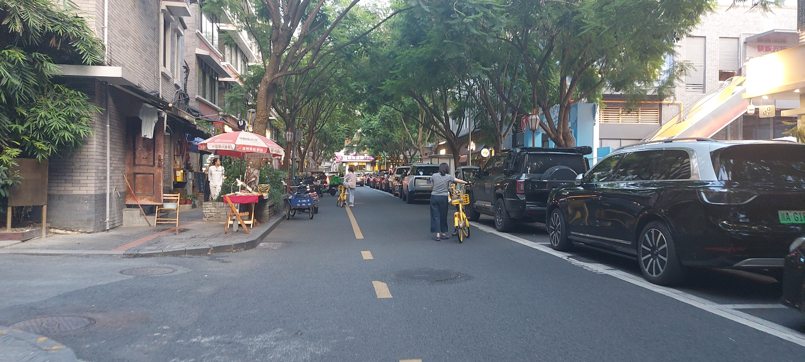
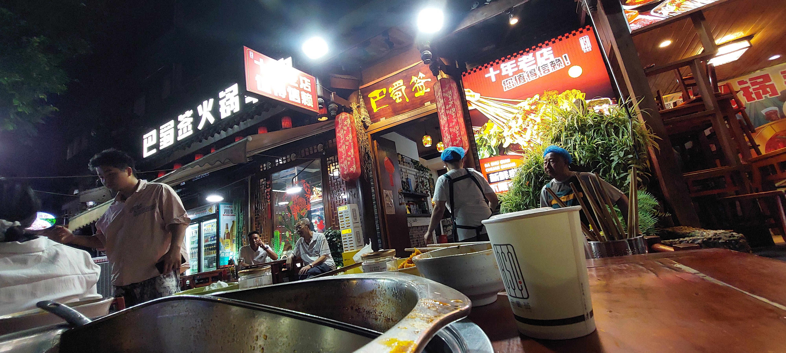
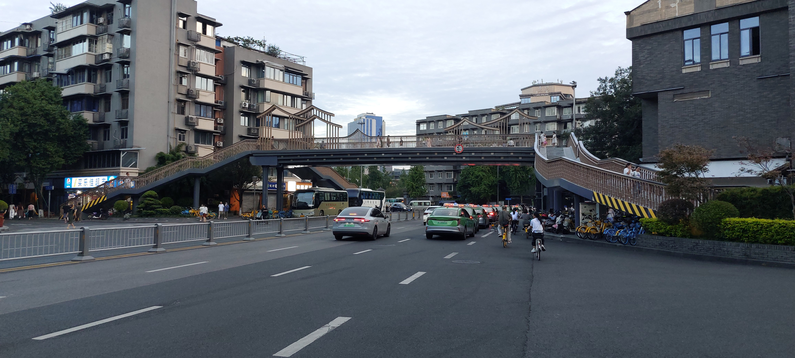

# **08‑30 : Les deux pieds dans la Chine 🇨🇳👣**

Arrivés à **Beijing** 🏯🛬, le trajet n’est pas terminé : nous devons encore prendre un second vol pour **Chengdu** ✈️🐼.

Pas très réveillés 😵‍💫 et complètement fatigués 😴, on fait nos **gros touristes** 😂…  
On montre simplement notre billet pour Chengdu au personnel de l’aéroport 👀🎫.  
Et ça marche **super bien** ✨ : le personnel est vraiment **bienveillant** 🤝💙 et nous indique le bureau de l’immigration.

Ayant déjà rempli notre **déclaration d’entrée en ligne** 🧾💻, nous passons les bornes et arrivons directement à la file d’attente du service immigration.

Là encore, ça va **très vite** ⚡.  
Le service est **ultra efficace** 🧑‍✈️📋 :  
- scan du passeport 🪪,  
- un automate nous parle en **français** 🇫🇷🤖,  
- photo 📸,  
- scan des empreintes digitales ✋🔍.

Une fois les formalités accomplies, on saute dans le **train-navette** pour rejoindre le **Terminal T3C**, celui des correspondances domestiques 🏢🇨🇳.

On passe ensuite un portique détecteur de métaux 🚨 et un scan de bagages 🎒📡.  
J’ai dû me **séparer de ma batterie externe** 🔋💀 : les contrôles chinois sont plus stricts, notamment sur les **powerbanks**, qui doivent afficher la norme **3C**.  
Ma batterie étant vieille et en micro‑USB 🧓🔌, ce n’était pas une grande perte 😅.  
En gros, j’ai ramené mon matériel usagé dans son pays de fabrication 🇨🇳😂.

Notre vol précédent ayant eu **1h de retard** ⏱️😑, on a dû presser le pas 🏃💨 car l’embarquement du second vol avait déjà commencé.  
On se dirige vers notre porte, on se met dans la file… et ça avance **super vite** encore une fois ⏩😌.

Après **3h de vol** 🛫⏳ et un repas servi en premier 🍱✨, nous arrivons enfin à **Chengdu** 🐼🌆.

Nous avions réservé un **transfert** entre l’aéroport et notre hôtel 🚗🏨.  
On s’est un peu pris pour **Mr. & Mrs. Smith** 😎🕶️ quand on a vu notre chauffeur nous attendre avec une pancarte à notre nom 📜👋.

Après une bonne heure de **voiture électrique** ⚡🚘, nous arrivons à l’hôtel.  
Je précise électrique car, sur tout le trajet, nous avons vu **très peu de voitures thermiques** 🔥🚫.

Après un scan de passeport à la réception 🪪📲 (on commence à s’y habituer 😅), on peut enfin faire une **pause** dans notre chambre 🛏️😌.

 Rue calme vers notre hôtel. Beaucoup d'arbres à Chengdu. 🌳 

En début de soirée 🌆✨, nous sommes allés à pied à **Kuanzhai Xiangzi Alleys** 🚶‍♂️🚶‍♀️🛍️ :  
des rues piétonnes très touristiques, remplies de boutiques 🎎🍵.  
Dégustations gratuites de thé 🍵😋, de boissons 🧋, et d’encas à base de champignons 🍄.

Et quand je parle de touristes… on a vu **très peu d’Européens** 👀🇪🇺.  
La majorité des visiteurs étaient asiatiques, probablement chinois 🇨🇳.

 Entrée d'une boutique dans les allées Kuanzhai Xiangzi.

Beaucoup de boutiques ont des entrées **hyper léchées** 🐉🔥 pour attirer les clients.  
Têtes de dragon, lanternes, décors traditionnels… 🎭✨.

Après nos amuse‑bouches 😋, nous nous sommes dirigés vers un **hotpot** 🔥🍲 vraiment sympa.  
La casserole était divisée en deux :  
- un côté **ultra pimenté** 🌶️🔥,  
- un côté compatible avec notre tolérance de **petits joueurs** 😅🌶️.

 Restaurant de "hotpot".

Après une glace à la mangue 🍨 et un thé glacé au jasmin 🧋🌼, nous avons longé un **canal** 🌊 jusqu’à l’hôtel.

La ruelle était dans la pénombre 🌙, nous avons croisé quelques personnes dans le noir 🚶‍♂️🚶‍♀️…  
Mais on se sent **vraiment en sécurité** en Chine 🔒🙂.  
L’omniprésence des caméras de surveillance 🎥👁️ a quelques avantages.

# **Bilan de cette première soirée 🌙🇨🇳✨**

On s’attendait à être **écrasés par la foule** 🧍🧍🧍, **harassés par le bruit** des voitures et des scooters 🚗🛵🔊…  
Mais **rien du tout** 😮❗

Les voitures et les scooters sont **électriques** ⚡🚘🛵 :  
➡️ donc **pas de bruit** 🔇  
➡️ et **pas d’odeur** 🌬️🚫

On a vu **plein de gens en vélo**, même de nuit 🌃🚴‍♂️🚴‍♀️ et parfois **sans éclairage** 😅💡.  
Comme quoi, rouler en vélo semble vraiment **safe** ici 🛡️🙂.

 Pont piéton, taxis, scooter, vélo, etc.

Bref, une **excellente première impression** de la Chine 🇨🇳💖.  
On verra demain avec les **35°C annoncés** 🌡️🔥😅…

Pas loin de l’hôtel, nous avons croisé une **boutique de fruits** 🍉🍇🍊.  
Ça pourrait être une bonne idée pour le **petit déjeuner du lendemain** 🥭🍌🥝😋…
